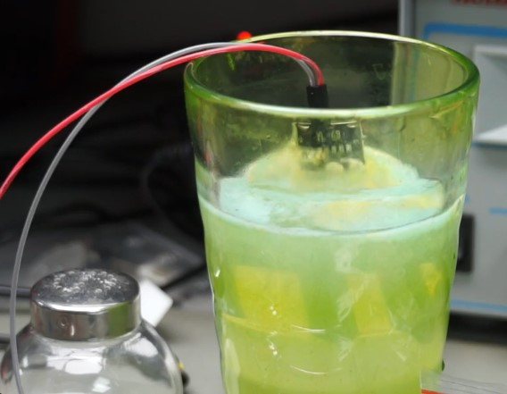
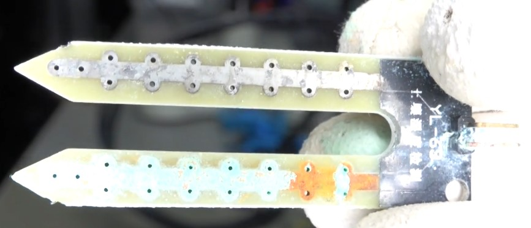
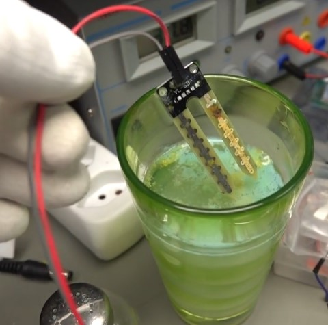
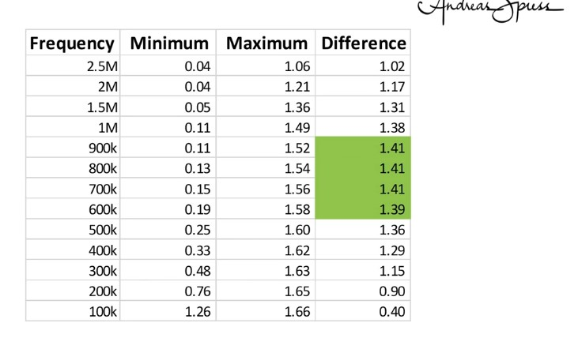
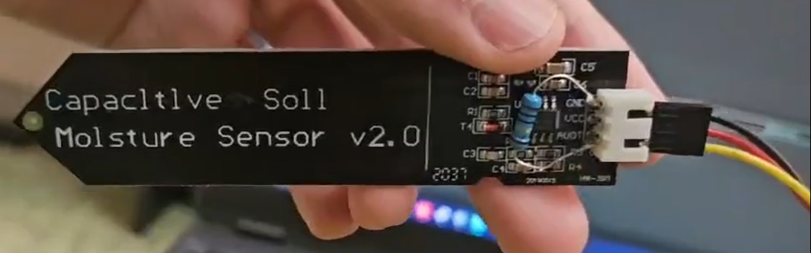
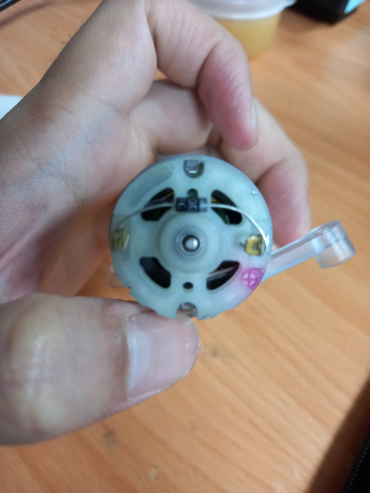
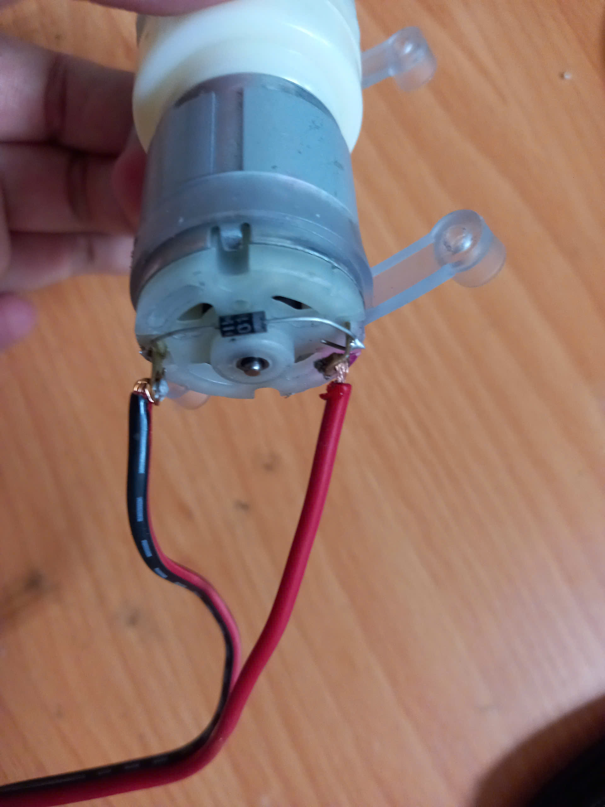
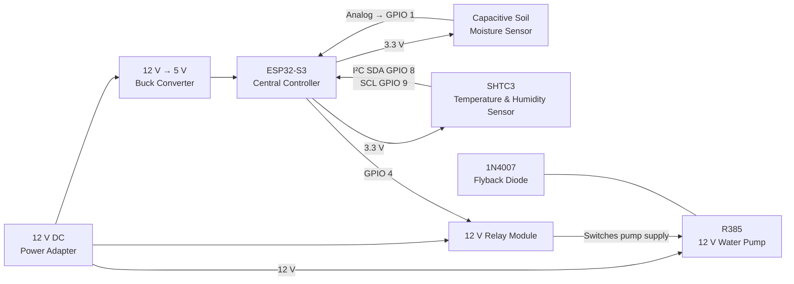
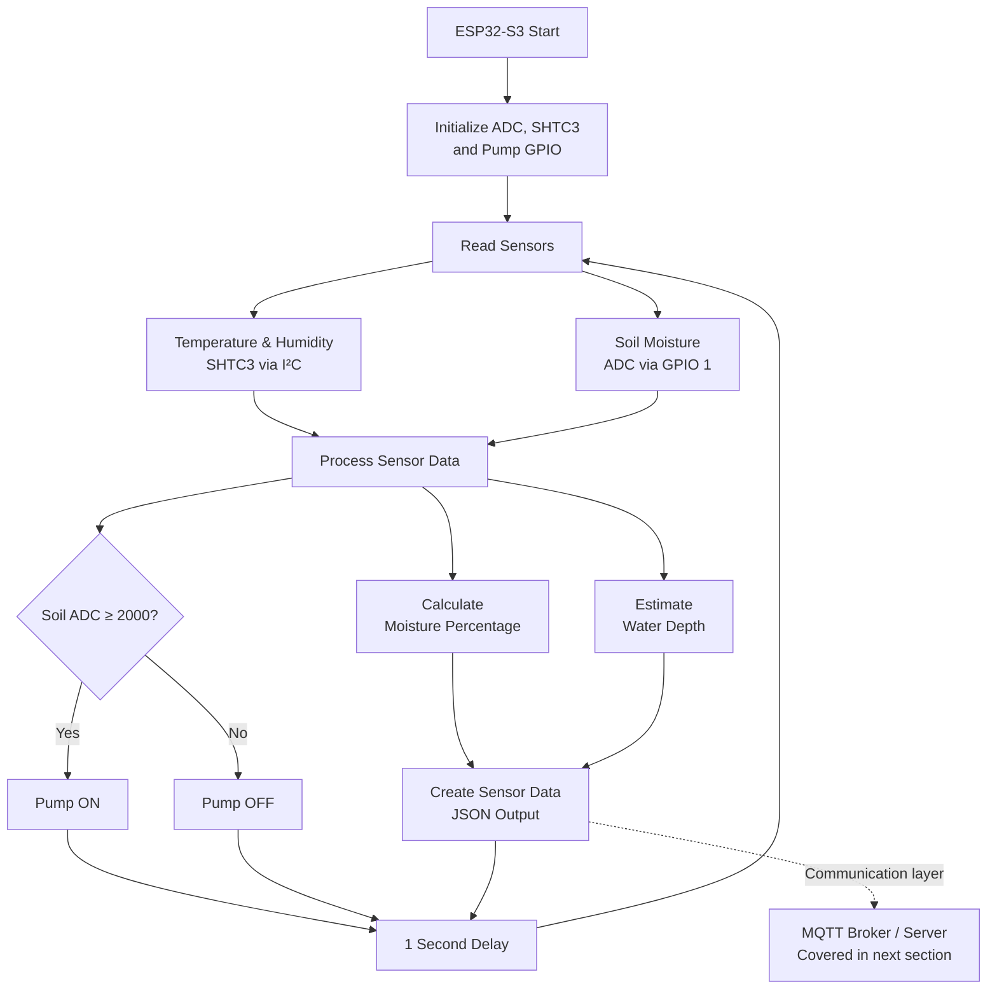
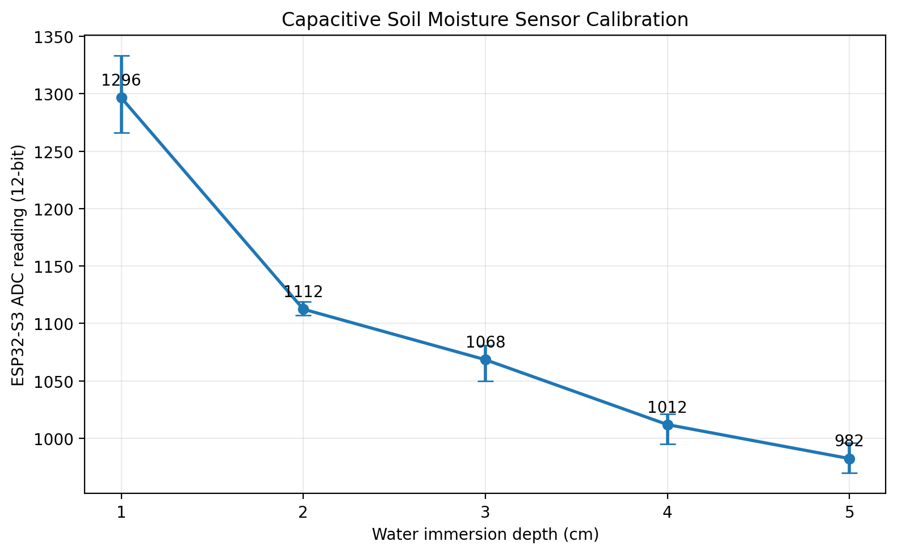

## Table of Contents
1. [Project Overview](#1-project-overview)
2. [Bill of Materials](#2-bill-of-materials)
3. [Pinout & Wiring](#3-pinout--wiring)
   - [ESP32-S3 Pinout](#esp32-s3-pinout-1)
   - [IO Shield Pinout](#io-shield-pinout-2)
   - [Wiring Diagram](#wiring-diagram)
   - [Physical Implementation](#physical-implementation)
   - [ESP32-S3 GPIO Mapping](#esp32-s3-gpio-mapping)
   - [Power Distribution & Actuator Wiring](#power-distribution--actuator-wiring)
4. [Hardware Decisions & Modifications](#4-hardware-decisions--modifications)
   - [Soil Moisture Sensor](#soil-moisture-sensor)
   - [Capacitive Sensor Modification](#capacitive-sensor-modification)
   - [Temperature and Humidity Sensor](#temperature-and-humidity-sensor)
   - [Flyback Diode for Water Pump](#flyback-diode-for-water-pump)
5. [Hardware Architecture](#5-hardware-architecture)
   - [Sensing Layer](#sensing-layer)
   - [Control Layer](#control-layer)
   - [Actuation Layer](#actuation-layer)
   - [Power Architecture](#power-architecture)
6. [Software Architecture](#6-software-architecture)
   - [Sensor Interface & Data Processing](#sensor-interface--data-processing)
   - [Water-Depth Calibration and Estimation](#water-depth-calibration-and-estimation)
   - [Automatic Irrigation Control](#automatic-irrigation-control)
   - [Sensor Data Output](#sensor-data-output)
7. [System Output](#7-system-output)
8. [Limitations and Future Improvements](#8-limitations-and-future-improvements)
9. [Conclusion](#9-conclusion)
10. [Bibliography](#10-bibliography)

## 1. Project Overview

## 2. Bill of Materials

| Component             | Model                                       | Specification              |
| :-------------------- | :------------------------------------------ | :------------------------: |
| Microcontroller       | MKE-K01 ESP32-S3 DevKit                     | 16MB Flash - 8MB PSRAM     |
| Expansion Board       | MKE-B01 ESP32-S3 DevKit IO Shield           | GPIO Breakout              |
| Soil Moisture Sensor  | Capacitive Soil Moisture Sensor v2.0        | 3.3V-5V, Analog            |
| Resistor              | Metal-Film Resistor                         | 1MΩ±1%                     |
| Environmental Sensor  | SHTC3 Digital Humidity & Temperature Sensor | 1.62V-3.6V, I2C            |
| Relay Module          | 1-Channel Opto-Isolated Relay               | 12VDC, 30A Contacts        |
| Flyback Diode         | 1N4007 Silicon Rectifier Diode              | 1A, 1000V                  |
| DC Power Adapter      | 5.5x2.1mm AC/DC Wall Adapter                | 12VDC, 3A                  |
| Step-down Converter   | Dual USB Buck Converter                     | 12VDC to 5VDC, 3A          |
| Water Pump            | R385 Water Pump                             | 12VDC                      |
| Adapter Cable         | Female DC Barrel Jack Cable                 | 5.5x2.1mm                  |
| Water Tubing          | Silicone Tube                               | 2x2m, 6mm ID - 8mm OD      |
| Electronics Enclosure | Waterproof Plastic Enclosure                | 83x58x33mm, IP65           |

## 3. Pinout & Wiring

### ESP32-S3 Pinout *[[1]](#cite1)*
<p align="center">
   
</p>

### IO Shield Pinout *[[2]](#cite2)*
<p align="center">
   
</p>

### Wiring Diagram
<p align="center">
   
</p>

### Physical Implementation

<p align="center">
    
    
</p>

---

### ESP32-S3 GPIO Mapping

| Component | Component Pin | GPIO Connection | Notes |
| :--- | :---: | :---: | :--- |
| **Soil Moisture Sensor** | VCC | `3V3` | 3.3V Power |
| | GND | `GND` | Ground |
| | AOUT | `GPIO 1` | Analog Output Signal |
| **SHTC3 Temp & Humidity** | VCC | `3V3` | 3.3V Power |
| | GND | `GND` | Ground |
| | SDA | `GPIO 8` | I2C Data Line |
| | SCL | `GPIO 9` | I2C Clock Line |
| **1-Channel Relay Module** | IN | `GPIO 4` | Relay Trigger Signal |

---

### Power Distribution & Actuator Wiring

| Source / Device | Pin / Terminal | Connected To |
| :--- | :---: | :--- |
| **12V Power Adapter** | `+` | Buck Converter `IN+`, Relay `COM`, Relay `DC+` |
| | `-` | Buck Converter `IN-`, Pump `(-)`, Relay `DC-` |
| **5V Buck Converter** | `USB-A` | ESP32-S3 `USB-C` |
| **Relay Module** | `NO` | Water Pump `(+)` |
| **Flyback Diode** | Stripe `Cathode` | Water Pump `(+)` |
| | No-Stripe `Anode` | Water Pump `(-)` |

---

## 4. Hardware Decisions & Modifications

### Soil Moisture Sensor

A **Capacitive Soil Moisture Sensor v2.0** was selected instead of a conventional resistive soil moisture sensor. The selection was based mainly on the sensing principle, expected durability during continuous installation, and the electrochemical problems associated with exposed resistive electrodes.

#### Resistive Soil Moisture Sensors

A typical resistive soil moisture sensor consists of two exposed conductive electrodes inserted into the soil. Electrically, the soil between the two electrodes behaves as a resistance whose value changes with the amount of water present.

In the circuit examined by Spiess [[3]](#cite3), the soil sensor is connected with a **510 kΩ resistor to form a voltage divider**. The analog output corresponds to the voltage produced by this divider. When more of the sensor is placed in water, the resistance between the two electrodes decreases and the analog output voltage also decreases. The controller board additionally contains a comparator for producing a digital threshold output, although the analog signal is more useful when the moisture level is processed directly in software [[3]](#cite3).

<p align="center">
    
</p>

<p align="center">
    <em>
        Figure 4.1. Resistive moisture sensor and controller circuit illustrating the voltage-divider measurement principle.
        Source: Spiess <a href="#cite3">[3]</a>.
    </em>
</p>

This measurement method is simple; however, it requires an electrical potential to be applied across two conductors that are directly exposed to moist soil. Consequently, current can flow through the water and dissolved ions in the soil. This creates conditions for **electrochemical reactions and electrode corrosion**.

#### Accelerated Corrosion Demonstration

Spiess demonstrates this problem experimentally by placing a resistive sensor in water. To make a process that would normally develop over a much longer period visible within a short demonstration, the electrodes are connected directly to a power supply **without the normal current limitation** [[3]](#cite3).

Therefore, the rate of damage shown in the experiment should not be interpreted as the normal corrosion rate of a sensor installed in soil. Instead, the experiment accelerates the same underlying electrochemical effect that can occur during long-term operation.

<p align="center">
    
</p>

<p align="center">
    <em>
        Figure 4.2. Accelerated corrosion experiment in which the resistive electrodes are connected without normal current limitation.
        Source: Spiess <a href="#cite3">[3]</a>.
    </em>
</p>

Shortly after the electrodes are energized, **gas bubbles become visible in the water** and one of the sensor legs begins to change colour. The bubbles show that electrochemical reactions are taking place while current flows through the water. At the same time, the conductive plating on one electrode starts to deteriorate [[3]](#cite3).

<p align="center">
    
</p>

<p align="center">
    <em>
        Figure 4.3. Gas bubbles forming around the energized resistive sensor electrodes during the accelerated corrosion test.
        Source: Spiess <a href="#cite3">[3]</a>.
    </em>
</p>

After several minutes, the damage becomes severe. One electrode loses its original conductive surface and the copper track is progressively removed. In the demonstration, enough copper is eventually removed that the conductive path becomes interrupted and current stops flowing. At this point, the sensor can no longer operate correctly [[3]](#cite3).

<p align="center">
    
</p>

<p align="center">
    <em>
        Figure 4.4. Visible deterioration of the resistive sensor electrodes after the accelerated electrolysis test.
        Source: Spiess <a href="#cite3">[3]</a>.
    </em>
</p>

The experiment also demonstrates another undesirable effect: material removed from the electrodes enters the surrounding water. The water becomes visibly discoloured as the electrodes degrade. In an irrigation application, the corresponding environment would be the soil surrounding the plant [[3]](#cite3).

<p align="center">
    
</p>

<p align="center">
    <em>
        Figure 4.5. Discoloration of the surrounding water following electrochemical degradation of the resistive electrodes.
        Source: Spiess <a href="#cite3">[3]</a>.
    </em>
</p>

Simply insulating the two electrodes is not an effective solution for this type of **resistive** sensor. Its operating principle depends on electrical conduction through the material between the electrodes. If the electrodes are completely isolated from the water or soil, the required conduction path is removed and the original resistive measurement principle no longer works [[3]](#cite3).

For a system intended to remain installed in soil and repeatedly measure moisture over a long period, this represents an important disadvantage. Electrode degradation not only reduces sensor lifetime but also changes the electrical properties of the sensing element, which may affect measurement consistency before complete failure occurs.

#### Capacitive Soil Moisture Sensor

A capacitive moisture sensor uses a different sensing principle. Its conductive sensing areas do not need to be directly exposed to the soil. Instead, the insulated conductive regions behave as the plates of a capacitor, and the electrical characteristics of this capacitor change depending on the surrounding moisture [[3]](#cite3).

The capacitive reactance can be expressed as:

$$
X_C = \frac{1}{2\pi f C}
$$

where:

- $X_C$ is the capacitive reactance;
- $f$ is the excitation frequency;
- $C$ is the capacitance.

As the effective capacitance changes with the surrounding moisture, the capacitive reactance also changes. From the equation, increasing capacitance causes the magnitude of the capacitive reactance to decrease when frequency is kept constant.

<p align="center">
    
</p>

<p align="center">
    <em>
        Figure 4.6. Relationship between capacitance, excitation frequency and capacitive reactance used to explain capacitive moisture sensing.
        Source: Spiess <a href="#cite3">[3]</a>.
    </em>
</p>

In the capacitive sensor examined by Spiess, a **555-family timer** generates a square-wave excitation signal. One sensing conductor is excited by this signal while the other is connected to ground. When the sensor is surrounded by water or moist soil, the capacitance formed by the insulated sensing conductors changes. A diode and capacitor are then used to smooth the resulting signal and provide an **analog output voltage** that changes with moisture [[3]](#cite3).

<p align="center">
    
</p>

<p align="center">
    <em>
        Figure 4.7. Example circuit of a capacitive soil moisture sensor using a 555-family timer and an isolated sensing element.
        Source: Spiess <a href="#cite3">[3]</a>.
    </em>
</p>

The excitation frequency also affects the usable measurement range. In the experiment presented by Spiess, the largest difference between the minimum and maximum sensor output was observed at approximately **600 kHz to 900 kHz**. The tested capacitive sensor operated at approximately **570 kHz** [[3]](#cite3).

<p align="center">
    
</p>

<p align="center">
    <em>
        Figure 4.8. Effect of excitation frequency on the measurement range of the capacitive moisture sensor.
        Source: Spiess <a href="#cite3">[3]</a>.
    </em>
</p>

The important difference for this project is that the sensing conductors of the capacitive sensor can remain **electrically isolated from the wet soil**. Therefore, moisture measurement does not require the continuous DC conduction path between exposed metal electrodes that causes the corrosion demonstrated with resistive probes.

#### Sensor Selection

The comparison that led to the final sensor selection is summarized below.

| Design Consideration | Resistive Sensor | Capacitive Sensor |
| :--- | :--- | :--- |
| Measurement principle | Electrical conduction through soil | Change in capacitance |
| Exposed sensing conductors | Yes | No exposed sensing copper required |
| DC current through moist soil | Required for measurement | Not required between exposed electrodes |
| Electrode corrosion | Significant long-term concern | Corrosion mechanism greatly reduced |
| Electrode material entering soil | Possible as electrodes degrade | Avoided at the insulated sensing surface |
| Analog measurement | Available | Available |
| Suitability for continuous installation | Lower | Better suited to the project |

For these reasons, the **capacitive soil moisture sensor was selected for the Smart Irrigation System**. The main advantage is not simply that it is a different type of moisture sensor, but that its sensing principle removes the exposed DC electrode interface responsible for the degradation demonstrated with resistive sensors.

In this project, the sensor is powered from **3.3 V**, and its analog output is connected to **GPIO 1** of the ESP32-S3. The sensor does not directly provide an absolute soil moisture percentage. Instead, its analog output is measured by the ESP32-S3 ADC and calibrated using experimentally determined dry and wet reference values. The measured ADC value is then converted into an estimated **soil moisture percentage** before being transmitted to the server.

> **Note:** The circuit-level explanation above describes the capacitive sensor examined in reference [[3]](#cite3). Different commercial revisions of capacitive soil moisture sensors may use different components or circuit implementations. The important design principle for this project is the insulated capacitive sensing method rather than the exact PCB implementation.

---

#### Capacitive Sensor Modification

Although the capacitive sensor avoids the electrode-corrosion problem of resistive sensors, some low-cost **v1.2/v2.0 capacitive soil moisture sensors contain a PCB design issue**. In the version discussed in [[4]](#cite4), the **1 MΩ resistor associated with the analog-output circuit is not correctly connected to ground**.

The sensor converts the moisture-dependent signal into an analog voltage using a diode and capacitor. The capacitor smooths the signal before it reaches the analog output. A high-value resistor provides a discharge path for this capacitor. Without this path, the capacitor can retain its charge, causing the analog output to respond slowly when the moisture level changes [[4]](#cite4).

To correct this issue, a **1 MΩ ±1% resistor** was added between the sensor's analog-output and ground connections.

<p align="center">
    
</p>

<p align="center">
    <em>
        Figure 4.9. Capacitive Soil Moisture Sensor v2.0 with the added 1 MΩ resistor used to correct the analog-output circuit.
    </em>
</p>

The modification does not change the capacitive sensing principle. Instead, it improves the analog-output stage by providing the capacitor with a discharge path, allowing the output voltage to respond more consistently to changes in soil moisture. This provides a more suitable analog signal for measurement by the ESP32-S3 ADC.

---
### Temperature and Humidity Sensor

An SHTC3 temperature and humidity sensor is installed inside the enclosure.

Unlike the soil moisture sensor, the SHTC3 is not currently used directly for irrigation control. Its purpose is to monitor the internal environmental conditions of the electronics enclosure.

The sensor provides:

- internal enclosure temperature;
- internal relative humidity.

This information can be useful for checking whether the electronics are operating in an unsuitable environment, for example if heat builds up inside the enclosure or if high humidity creates a risk of condensation.

The SHTC3 communicates with the ESP32-S3 using the I2C interface.

---

### Flyback Diode for Water Pump

The R385 water pump is driven by a **12 V DC motor**, which behaves as an inductive load. While the motor is running, energy is stored in its magnetic field. When the relay switches the pump off, this magnetic field collapses and the motor can generate a short **reverse-polarity voltage spike**, known as inductive kickback or flyback voltage [[5]](#cite5).

This transient voltage can be much higher than the normal supply voltage. If it is not suppressed, it may cause arcing across the relay contacts and introduce electrical noise or voltage disturbances into the power system. These disturbances can affect sensitive electronics such as the ESP32-S3, potentially causing unstable operation or unexpected resets.

For this reason, a **1N4007 flyback diode** was installed directly across the terminals of the pump motor.

<p align="center">
    
    
</p>

<p align="center">
    <em>
        Figure 4.10. 1N4007 flyback diode installed across the terminals of the R385 water-pump motor.
    </em>
</p>

During normal pump operation, the diode is **reverse-biased**, so it does not conduct and has no effect on the motor. When the pump is switched off, the polarity across the motor reverses. The diode then becomes forward-biased and provides a path for the remaining motor current to circulate and decay safely [[5]](#cite5).

Instead of allowing the stored energy in the motor to create a large voltage spike, the diode helps dissipate this energy through the motor and diode path. This provides several protective benefits:

* reduces the voltage spike produced when the motor is switched off;
* reduces arcing and wear on the relay contacts;
* reduces electrical noise in the power system;
* helps prevent switching transients from disturbing the ESP32-S3 and other electronics;
* improves the reliability of repeated pump switching.

The flyback diode therefore acts as a simple but important **protection component** in the irrigation system. Its purpose is not to supply power to the motor, but to safely handle the inductive energy released when the motor is turned off, protecting both the relay switching circuit and the sensitive control electronics.

---

## 5. Hardware Architecture

The hardware architecture of the Smart Irrigation System is organized around the **ESP32-S3**, which acts as the central controller. It acquires measurements from the soil-moisture and environmental sensors, processes these measurements, and controls the water pump through a relay module.

The system uses a **12 V DC power supply** as its main power source. The 12 V supply powers the water pump and relay module directly, while a buck converter steps the voltage down to **5 V** for the ESP32-S3. The sensors are then powered from the ESP32-S3's **3.3 V rail**.



<p align="center">
    <em>
        Figure 5.1. Hardware architecture of the Smart Irrigation System.
    </em>
</p>

### Sensing Layer

The system contains two sensing devices.

The **Capacitive Soil Moisture Sensor v2.0** measures the moisture condition of the soil and produces an analog voltage. Its analog output is connected to **GPIO 1**, where it is measured using the ESP32-S3 ADC. The sensor is powered from 3.3 V. As discussed previously, a **1 MΩ resistor modification** was also applied to improve the response of the sensor's analog-output circuit.

The **SHTC3 temperature and humidity sensor** is installed inside the electronics enclosure to monitor its environmental conditions. It communicates digitally with the ESP32-S3 through the I²C interface, using **GPIO 8 for SDA** and **GPIO 9 for SCL**.

### Control Layer

The **ESP32-S3** is the main processing and control device. The MKE-B01 IO Shield provides convenient access to its GPIO and power connections.

The ESP32-S3 performs three main hardware-level functions:

* acquires the analog soil-moisture measurement;
* communicates with the SHTC3 environmental sensor;
* controls the relay responsible for switching the water pump.

The relay control input is connected to **GPIO 4**. This allows the low-voltage ESP32-S3 control signal to switch the separate 12 V pump circuit without requiring the microcontroller to supply the motor current directly.

### Actuation Layer

Water delivery is performed by the **12 V R385 water pump**. Because the pump requires considerably more current than an ESP32-S3 GPIO can provide, it is switched through a dedicated relay.

When irrigation is required, the ESP32-S3 activates the relay, which connects the 12 V supply to the pump. When irrigation is stopped, the relay disconnects the pump.

A **1N4007 flyback diode** is installed directly across the pump motor terminals. The diode suppresses the inductive voltage transient generated when the motor is switched off. This reduces stress on the relay contacts and helps prevent switching noise and voltage disturbances from affecting the ESP32-S3 and other electronics.

### Power Architecture

The system uses two main voltage levels:

|    Voltage   | Devices Supplied                               |
| :----------: | :--------------------------------------------- |
|  **12 V DC** | Water pump, relay module, buck-converter input |
|  **5 V DC**  | ESP32-S3 through USB-C                         |
| **3.3 V DC** | Soil-moisture sensor and SHTC3 sensor          |

The use of separate voltage levels allows the high-current pump to operate from its required 12 V supply while the ESP32-S3 and sensors operate at their appropriate lower voltages.

Overall, the architecture separates the system into **sensing, control, and actuation stages**. The ESP32-S3 forms the connection between these stages: sensor information is acquired and processed by the controller, while the irrigation output is implemented through the relay and 12 V water pump. This separation prevents the motor load from being driven directly by the microcontroller and provides a more reliable hardware design for automatic irrigation.

## 6. Software Architecture

The ESP32-S3 firmware is responsible for **sensor acquisition, data processing, irrigation control, and preparation of sensor data for communication with the rest of the system**. The program runs continuously and updates the measurements and pump state once per second.

The software is divided logically into four main stages:

1. **Hardware initialization**
2. **Sensor data acquisition**
3. **Data processing and calibration**
4. **Automatic irrigation control**

The processed measurements are also formatted as a structured JSON message. This provides a clear interface for the communication layer, where the data can later be transmitted through MQTT to the self-hosted server.



<p align="center">
    <em>
        Figure 6.1. ESP32-S3 software architecture showing sensor acquisition, processing, irrigation control, and the interface to the communication layer.
    </em>
</p>

### Sensor Interface & Data Processing

When the ESP32-S3 starts, the firmware initializes the required hardware interfaces. The ADC is configured to **12-bit resolution**, the SHTC3 temperature and humidity sensor is initialized through I²C, and the pump-control GPIO is configured as a digital output.

```cpp
analogReadResolution(12);

if (!shtc3.begin()) {
    Serial.println("Couldn't find SHTC3");
    while (1) delay(1);
}

pinMode(PUMP_PIN, OUTPUT);
```

After initialization, the ESP32-S3 continuously acquires measurements from the two sensors.

The **SHTC3** provides enclosure temperature and relative humidity:

```cpp
sensors_event_t humidity, temp;
shtc3.getEvent(&humidity, &temp);
```

The **capacitive soil moisture sensor** is read through GPIO 1 using the ESP32-S3 ADC:

```cpp
int rawValue = analogRead(SOIL_PIN);
```

The raw soil-moisture ADC value is then converted into an estimated moisture percentage using the experimentally determined dry and wet calibration references:

```cpp
const int VAL_DRY = 2350;
const int VAL_WET_SOIL = 1550;

int moisturePercent =
    map(rawValue, VAL_DRY, VAL_WET_SOIL, 0, 100);

moisturePercent =
    constrain(moisturePercent, 0, 100);
```

A reading close to the dry reference corresponds to approximately **0% soil moisture**, while readings at or below the wet reference are limited to **100%**. This provides a more understandable representation of the soil condition than displaying the raw ADC value alone.

The processed soil measurement is then used for both **water-depth estimation** and **automatic irrigation control** in the following stages of the software.

### Water-Depth Calibration and Estimation

Additional calibration measurements were performed by immersing the capacitive sensor at fixed water depths. Multiple ADC measurements were recorded at each depth and averaged to characterize the response of the sensor. The recorded calibration data shows that the sensor output decreases as the immersion depth increases.

| Water Depth | Average ADC Reading |
| :---------: | :-----------------: |
|     1 cm    |         1297        |
|     2 cm    |         1112        |
|     3 cm    |         1068        |
|     4 cm    |         1012        |
|     5 cm    |         982         |

<p align="center">
    
</p>

<p align="center">
    <em>
        Figure 6.2. Measured ADC response of the capacitive soil moisture sensor at different immersion depths.
    </em>
</p>

The calibration results show that the relationship between water depth and ADC reading is **non-linear**. The largest ADC change occurs at shallow immersion depths. As more of the sensor is submerged, the difference in ADC reading produced by each additional centimetre generally becomes smaller.

For example, increasing the water depth from 1 cm to 2 cm changes the average ADC reading by approximately **185 counts**, whereas increasing the depth from 4 cm to 5 cm changes the reading by only approximately **30 counts**.

This indicates that the **sensor sensitivity generally decreases as the water depth increases**. In other words, the calibration curve becomes flatter at greater immersion depths.

Because of this non-linear response, the firmware does not use one single linear equation for the entire measurement range. Instead, it uses several calibration points and performs **piecewise linear interpolation** between adjacent values.

During later testing of the complete system, the calculated depth was also observed to underestimate the physical water level by approximately **1 cm in the shallow measurement range**. The calibration values used in the final firmware were therefore adjusted empirically based on physical validation.

The final reference points used in the software are:

| Estimated Water Depth | Final ADC Reference |
| :-------------------: | :-----------------: |
|          1 cm         |         1550        |
|          2 cm         |         1300        |
|          3 cm         |         1113        |
|          4 cm         |         1068        |
|          5 cm         |         1012        |
|          6 cm         |         981         |

The value of **1550** is used as the transition between saturated soil and approximately 1 cm of standing water. The remaining values are based on the measured calibration results with the approximately 1 cm correction applied.

For example, when the ADC reading lies between the 2 cm and 3 cm calibration points, the firmware calculates an intermediate depth using:

```cpp
if (rawValue > VAL_3CM) {
    waterDepthCm =
        2.0 + ((VAL_2CM - rawValue) /
        (float)(VAL_2CM - VAL_3CM));
}
```

The same interpolation method is repeated between the remaining calibration points.

This approach produces a continuous water-depth estimate instead of forcing the output into fixed integer steps. It also allows the software to better account for the reduced sensitivity observed at higher water levels.

### Automatic Irrigation Control

The irrigation decision is currently performed directly by the ESP32-S3 using the soil-moisture ADC measurement.

A threshold of **2000** is used:

```cpp
if (rawValue >= 2000) {
    digitalWrite(PUMP_PIN, HIGH);
}
else {
    digitalWrite(PUMP_PIN, LOW);
}
```

Because a higher ADC value represents drier soil, the pump is activated when the reading reaches or exceeds 2000. When the reading falls below this threshold, the pump is switched off.

This means that the basic irrigation function remains local to the ESP32-S3. The pump does not depend on the remote server or MQTT connection being available before an irrigation decision can be made.

This separation is useful because the **control loop remains functional even if network communication is temporarily unavailable**.

### Sensor Data Output

After the measurements have been processed, the ESP32-S3 combines the important soil values into a **JSON-formatted data structure**:

```json
{
  "raw": 1840,
  "moisture_percent": 68,
  "water_depth_cm": 0.00
}
```

The current firmware outputs this structure through the serial interface. The structured format provides a convenient interface between the embedded firmware and the later communication layer.

Using JSON also simplifies the transition to MQTT because the processed measurements can be packaged into a message without requiring the server to interpret separate unformatted values.

The overall software data flow can therefore be summarized as:

`Sensors → ESP32-S3 → Calibration & Processing → Irrigation Decision → Structured Data → Communication Layer`

The ESP32-S3 firmware is responsible for acquiring and processing the sensor measurements and controlling the physical irrigation hardware. The next stage of the software architecture extends this local control system by transmitting the processed data through **MQTT** to the project's **self-hosted server**, where it can be stored, processed further, and displayed to the user.

## 7. System Output

### Soil Moisture Sensor & Automatic Pump Test

[▶ View Demo](Demo/demo1.mp4)

### Final Enclosed System & Serial Monitor Demonstration

[▶ View Demo](Demo/demo2.mp4).

## 8. Limitations and Future Improvements

The current Smart Irrigation System successfully performs soil-moisture monitoring and automatic pump control, but several parts of the final design were influenced by component availability, troubleshooting difficulties, and the project deadline. As a result, there are several areas where the system could be made smaller, more power-efficient, and more suitable for long-term deployment.

### Lower-Power Controller and Motor Driver

The original design used an **ESP32-C3 together with a MOSFET-based motor driver**. The intention was to create a smaller and more energy-efficient system than the final ESP32-S3 and relay implementation.

During prototyping, the MOSFET switching circuit initially operated but later could not be switched reliably by the ESP32-C3. Directly driving the switching stage from the supply produced the expected response, and separate LED testing confirmed that the ESP32-C3 GPIO was still producing an output signal. However, the exact cause of the MOSFET-driver problem was not identified. During further troubleshooting, the ESP32-C3 was accidentally damaged by a short circuit.

Because the remaining development time was limited, the controller and switching stage were replaced with an **ESP32-S3, IO shield, and relay module**, which provided a more straightforward and reliable implementation. The available 12 V relay module was rated for 30 A, which is considerably higher than required by the R385 pump. Although functional, this combination occupies considerably more enclosure space than the original ESP32-C3 and MOSFET design.

A future version could return to the ESP32-C3 and use a properly designed logic-level MOSFET driver. This would reduce the physical footprint and remove the continuously energized relay coil. The ESP32-C3 could also make greater use of **deep-sleep operation**, waking periodically to take measurements and returning to sleep when no control action or communication is required. This could substantially reduce the controller's average power consumption.

### Variable Pump Control and Drip Irrigation

The current relay provides only two pump states: **fully ON or fully OFF**. A MOSFET driver would allow the pump to be controlled using PWM, providing the possibility of adjusting the average motor drive according to the required water flow.

This would allow the pump to operate more gently instead of repeatedly switching immediately between zero and full power. PWM itself does not directly guarantee a fixed motor current, so a future current-controlled design would require appropriate electrical feedback if precise current limiting were required. However, variable-speed control could still provide better control over the delivered water flow.

A future irrigation design could also use a **recirculating water reservoir and drip-irrigation network**. Small outlet holes or dedicated drip emitters could distribute water gradually around the plant rather than relying on a comparatively large amount of water delivered directly by the pump. Combining variable pump control with drip irrigation could provide more controlled watering and potentially reduce unnecessary water usage.

### Battery-Powered Operation

The present system requires an external power adapter, which limits where the unit can be installed.

A future version could be designed around a rechargeable battery system. When combined with a lower-power ESP32-C3, deep-sleep operation, and a MOSFET motor driver, battery operation could make the system significantly more portable and reduce its dependence on a nearby electrical outlet.

However, integrating lithium-based batteries would require substantially more attention to electrical safety. A practical design would require appropriate battery protection, charging circuitry, over-current protection, undervoltage protection, and a suitable enclosure. These features were intentionally not implemented in the current project because an improperly designed lithium-battery system can introduce fire and thermal hazards.

### Custom Electronics and PCB Design

The current prototype relies heavily on commercially available development boards and modules. This approach reduced development risk and allowed individual sections of the system to be replaced and tested easily, but it also increases the overall physical size and introduces circuitry that is not necessarily required by the final application.

A more advanced version could replace several pre-built modules with only the required integrated circuits and discrete components. Voltage, current, and operating conditions could then be characterized using appropriate measurement equipment before integrating them into the final system.

The project initially avoided this approach because designing the electronics at component level would have introduced additional development and debugging risk under the available time constraint.

A further improvement would be the development of a **custom PCB** containing the microcontroller, sensor interfaces, motor driver, voltage regulation, and protection circuitry. This could substantially reduce wiring, enclosure volume, and unnecessary module overhead while producing a more compact and power-efficient system.

### Water Reservoir Monitoring

An ultrasonic distance sensor was obtained with the intention of measuring the remaining water level inside the reservoir, but this feature was not completed within the project timeframe.

In a future implementation, the ultrasonic sensor could measure the distance between the sensor and the surface of the water. From the known dimensions of the reservoir, this measurement could be converted into an estimated water level or remaining volume.

This would allow the system to detect when the irrigation reservoir is nearly empty and notify the user before the pump attempts to operate without sufficient water.

### Environmental Safety Monitoring

The SHTC3 currently measures the temperature and relative humidity inside the electronics enclosure, but these measurements are used primarily for monitoring rather than active protection.

A future version could define safe operating limits for enclosure temperature and humidity. If either measurement exceeds its permitted range for a sustained period, the system could generate an alarm through the server interface.

For example, unusually high internal humidity could indicate water ingress or condensation, while excessive temperature could indicate unsuitable environmental conditions or an electrical problem. The server could notify the user that the enclosure should be inspected before the condition causes damage to the electronics.

### Sensor Measurement Limitations

Experimental calibration of the capacitive soil moisture sensor also showed that its response is not linear over the complete sensing area. The change in ADC reading was considerably larger at shallow immersion depths and became progressively smaller as more of the sensor was submerged.

This means that the sensor provides lower sensitivity at greater water depths, making small changes increasingly difficult to distinguish in the upper portion of the measurement range. The current software partially compensates for this behaviour through experimentally determined calibration points and piecewise linear interpolation.

For future development, calibration could be performed using a larger number of measurement points and repeated across different soil types rather than relying primarily on controlled water-immersion testing. This would provide a calibration model that more closely represents the conditions experienced during actual irrigation.

## 10. Bibliography:

<a id="cite1"></a>[1] MakerEduVN, "MKE-K01-ESP32-S3-DEV-KIT," _GitHub_, `MKE-K01-ESP32-S3-DEV-KIT/extras/MKE-K01_1.png`, May 2026. [Online]. Available: https://github.com/makereduvn/MKE-K01-ESP32-S3-DEV-KIT. [Accessed: July 27, 2026].

<a id="cite2"></a>[2] MakerEduVN, "MakerEdu MKE-B01 ESP32-S3 IO Shield," _GitHub_, `MKE-B01-ESP32-S3-DK-IO-SHIELD/extras/MKE-B01_2.png`, July 2026. [Online]. Available: https://github.com/makereduvn/MKE-B01-ESP32-S3-DK-IO-SHIELD. [Accessed: August 9, 2026].

<a id="cite3"></a>[3] Andreas Spiess, "#207 Why most Arduino Soil Moisture Sensors suck (incl. solution)," _YouTube_, June 2018. [Online]. Available: https://www.youtube.com/watch?v=udmJyncDvw0. [Accessed: June 3, 2026].

<a id="cite4"></a>[4] Flaura - Smart Plant Pot, "Capacitive Soil Moisture Sensors don't work correctly + Fix for v2.0 v1.2 Arduino ESP32 Raspberry Pi," _YouTube_, October 2021. [Online]. Available: https://www.youtube.com/watch?v=IGP38bz-K48. [Accessed: June 3, 2026].

<a id="cite5"></a>[5] Julian Ilett, "Flyback Diode to Protect Relay," _YouTube_, March 2020. [Online]. Available: https://www.youtube.com/watch?v=gGBrkVRu_Sk. [Accessed: June 9, 2026].

<!--
## References
- [ESP32: Build Your Own Smart Home Sensor in 10 Minutes](https://www.youtube.com/watch?v=llA2mdCh7Kc)
- [Wireless Soil Moisture Sensor Series](https://www.youtube.com/playlist?list=PLUUG94AI2ymwWiahyhoqb7W22lq5oEMo-)
- [Saving Plants - DIY Plant Watering Device](https://github.com/DFRobot/SmartWateringDevice)
-->
