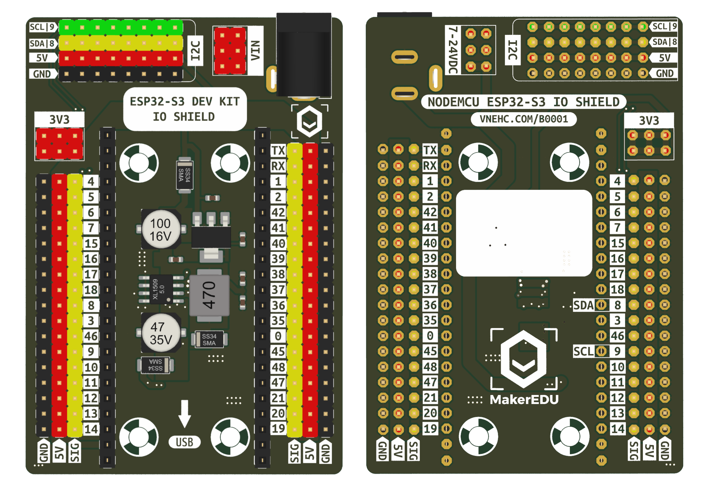

## Table of Contents

1. [Project Overview](#project-overview)
2. [Bill of Materials](#bill-of-materials)
3. [Pinout & Wiring Diagram](#pinout--wiring-diagram)
   - [ESP32-S3 Pinout](#1-esp32-s3-pinout-1)
   - [IO Shield Pinout](#2-io-shield-pinout-2)
   - [Wiring Diagram](#3-wiring-diagram)
   - [ESP32-S3 GPIO Mapping](#4-esp32-s3-gpio-mapping)
   - [Power Distribution & Actuator Wiring](#5-power-distribution--actuator-wiring)
4. [Sensors](#sensors)
5. [System Output](#system-output)
6. [Hardware Architecture](#hardware-architecture)
7. [Software Architecture](#software-architecture)
8. [Testing](#testing)
9. [Limitations and Future Improvements](#limitations-and-future-improvements)
10. [Conclusion](#conclusion)
11. [Citations](#citations)

## Bill of Materials

| Item | Model | Specification|
|:------------|:------------|:------------:|
| Microcontroller | ESP32-S3 DevKit | 16MB Flash - 8MB PSRAM |
| Expansion Board | MKE-B01 ESP32-S3 DK IO Shield | Breakout |
| Soil Moisture Sensor | Generic Capacitive Soil Moisture Sensor v2.0 | 3.3V-5V (Analog) |
| Environmental Sensor | SHTC3 Digital Humidity & Temperature Sensor | 3.3V (I2C) |
| Motor Controller | 1-Channel Opto-Isolated Relay Module | 12VDC - 30A |
| DC Power Adapter |  AC/DC Wall Adapter | 12VDC - 3A (5.5x2.1mm) |
| Step-down Converter | Dual USB Buck Converter | 5VDC - 3A |
| Water Pump | R385 Water Pump | 12VDC |
| Adapter Cable | Female DC Barrel Jack Cable| 5.5x2.1mm Jack |

## Pinout & Wiring Diagram

### 1. ESP32-S3 Pinout *[[1]](#cite1)*

### 2. IO Shield Pinout *[[2]](#cite2)*

### 3. Wiring Diagram

---

### 4. ESP32-S3 GPIO Mapping

| Component | Component Pin | GPIO Connection | Notes |
| :--- | :---: | :---: | :--- |
| **Soil Moisture Sensor** | VCC | `3V3` | 3.3V Power |
| | GND | `GND` | Ground |
| | AOUT | `GPIO 1` | Analog Output Signal |
| **SHTC3 Temp & Humidity** | VCC | `3V3` | 3.3V Power |
| | GND | `GND` | Ground |
| | SDA | `GPIO 8` | I2C Data Line |
| | SCL | `GPIO 9` | I2C Clock Line |
| **1-Channel Relay Module** | IN | `GPIO 4` | Relay Trigger Signal |

---

### 5. Power Distribution & Actuator Wiring

| Source / Device | Pin / Terminal | Connected To |
| :--- | :---: | :--- |
| **12V DC Adapter** | `+` (Positive) | Buck Converter `IN+`, Relay `COM`, Relay `DC+` |
| | `-` (Ground) | Buck Converter `IN-`, Pump `(-)`, Relay `DC-` |
| **Step-Down Buck Converter** | USB A | ESP32-S3 USB C |
| **1-Channel Relay Module** | `NO` (Normally Open) | Water Pump `(+)` |

## Citations:
[1] [MakerEdu MKE-K01 ESP32-S3 DevKit](https://github.com/makereduvn/MKE-K01-ESP32-S3-DEV-KIT). Sơ đồ chân.  
[2] [MakerEdu MKE-B01 ESP32-S3 IO Shield](https://github.com/makereduvn/MKE-B01-ESP32-S3-DK-IO-SHIELD). Hình ảnh sản phẩm.
<!--
## References

- [Why most Arduino Soil Moisture Sensors suck](https://www.youtube.com/watch?v=udmJyncDvw0)
- [ESP32: Build Your Own Smart Home Sensor in 10 Minutes](https://www.youtube.com/watch?v=llA2mdCh7Kc)
- [Wireless Soil Moisture Sensor Series](https://www.youtube.com/playlist?list=PLUUG94AI2ymwWiahyhoqb7W22lq5oEMo-)
- [Flaura - Smart Plant Pot](https://www.youtube.com/@FlauraSmartPlantPot/featured)
- [Saving Plants - DIY Plant Watering Device](https://github.com/DFRobot/SmartWateringDevice)
-->
