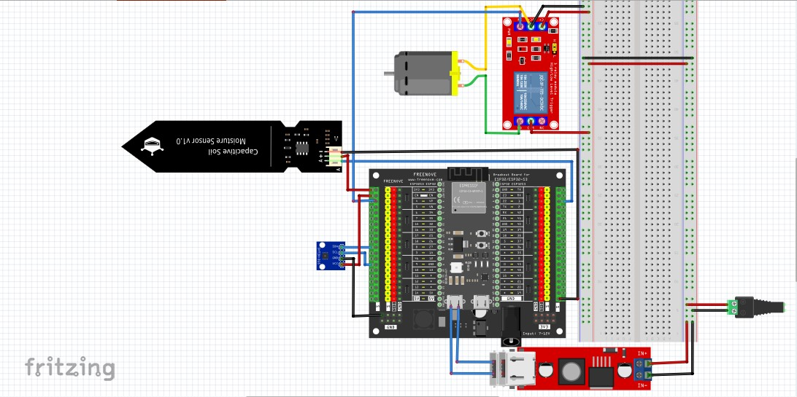
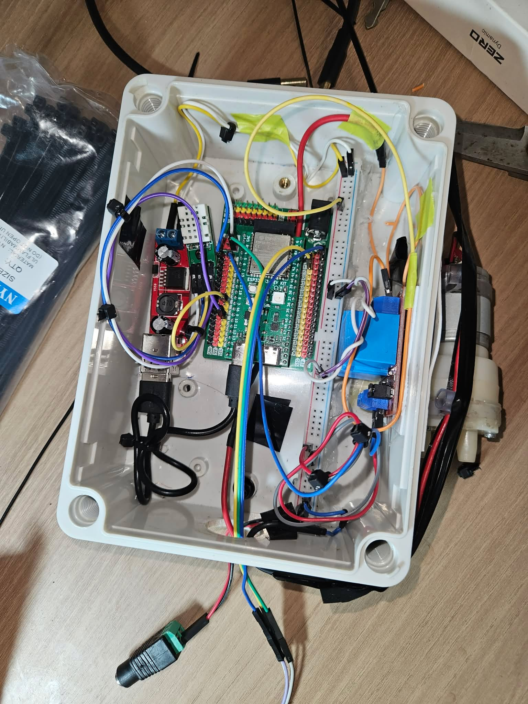
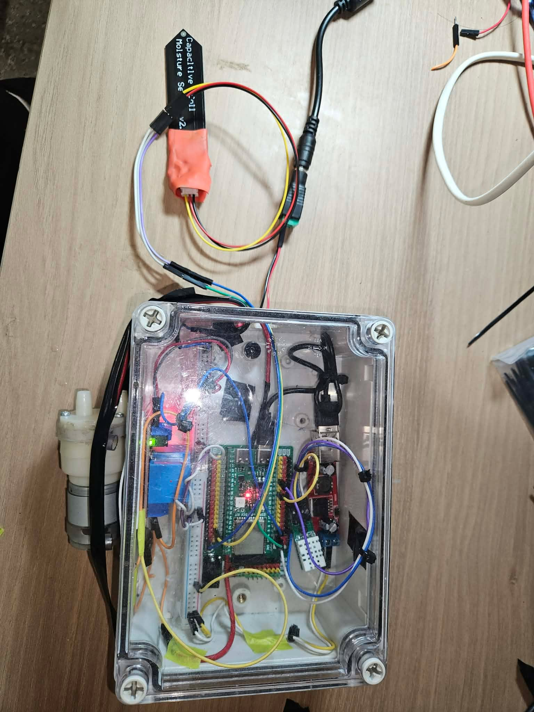

## Table of Contents
1. [Project Overview](#1-project-overview)
2. [Bill of Materials](#2-bill-of-materials)
3. [Pinout & Wiring](#3-pinout--wiring)
   - [ESP32-S3 Pinout](#esp32-s3-pinout-1)
   - [IO Shield Pinout](#io-shield-pinout-2)
   - [Wiring Diagram](#wiring-diagram)
   - [Physical Implementation](#physical-implementation)
   - [ESP32-S3 GPIO Mapping](#esp32-s3-gpio-mapping)
   - [Power Distribution & Actuator Wiring](#power-distribution--actuator-wiring)
4. [Sensors and Hardware Design Decisions](#4-sensors-and-hardware-design-decisions)
5. [Hardware Architecture](#5-hardware-architecture)
6. [Software Architecture](#6-software-architecture)
7. [System Output](#7-system-output)
8. [Limitations and Future Improvements](#8-limitations-and-future-improvements)
9. [Conclusion](#9-conclusion)
10. [Bibliography](#10-bibliography)

## 1. Project Overview

## 2. Bill of Materials

| Component             | Model                                       | Specification              |
| :-------------------- | :------------------------------------------ | :------------------------: |
| Microcontroller       | MKE-K01 ESP32-S3 DevKit                     | 16MB Flash - 8MB PSRAM     |
| Expansion Board       | MKE-B01 ESP32-S3 DevKit IO Shield           | GPIO Breakout              |
| Soil Moisture Sensor  | Capacitive Soil Moisture Sensor v2.0        | 3.3V-5V, Analog            |
| Resistor              | Metal-Film Resistor                         | 1MΩ±1%                     |
| Environmental Sensor  | SHTC3 Digital Humidity & Temperature Sensor | 1.62V-3.6V, I2C            |
| Relay Module          | 1-Channel Opto-Isolated Relay               | 12VDC, 30A Contacts        |
| Flyback Diode         | 1N4007 Silicon Rectifier Diode              | 1A, 1000V                  |
| DC Power Adapter      | 5.5x2.1mm AC/DC Wall Adapter                | 12VDC, 3A                  |
| Step-down Converter   | Dual USB Buck Converter                     | 12VDC to 5VDC, 3A          |
| Water Pump            | R385 Water Pump                             | 12VDC                      |
| Adapter Cable         | Female DC Barrel Jack Cable                 | 5.5x2.1mm                  |
| Water Tubing          | Silicone Tube                               | 2x2m, 6mm ID - 8mm OD      |
| Electronics Enclosure | Waterproof Plastic Enclosure                | 83x58x33mm, IP65           |

## 3. Pinout & Wiring

### ESP32-S3 Pinout *[[1]](#cite1)*

   

### IO Shield Pinout *[[2]](#cite2)*

   

### Wiring Diagram

   

### Physical Implementation

    
    

---

### ESP32-S3 GPIO Mapping

| Component | Component Pin | GPIO Connection | Notes |
| :--- | :---: | :---: | :--- |
| **Soil Moisture Sensor** | VCC | `3V3` | 3.3V Power |
| | GND | `GND` | Ground |
| | AOUT | `GPIO 1` | Analog Output Signal |
| **SHTC3 Temp & Humidity** | VCC | `3V3` | 3.3V Power |
| | GND | `GND` | Ground |
| | SDA | `GPIO 8` | I2C Data Line |
| | SCL | `GPIO 9` | I2C Clock Line |
| **1-Channel Relay Module** | IN | `GPIO 4` | Relay Trigger Signal |

---

### Power Distribution & Actuator Wiring

| Source / Device | Pin / Terminal | Connected To |
| :--- | :---: | :--- |
| **12V Power Adapter** | `+` | Buck Converter `IN+`, Relay `COM`, Relay `DC+` |
| | `-` | Buck Converter `IN-`, Pump `(-)`, Relay `DC-` |
| **5V Buck Converter** | `USB-A` | ESP32-S3 `USB-C` |
| **Relay Module** | `NO` | Water Pump `(+)` |
| **Flyback Diode** | Stripe `Cathode` | Water Pump `(+)` |
| | No-Stripe `Anode` | Water Pump `(-)` |

---

## 4. Sensors and Hardware Design Decisions

### Capacitive Soil Moisture Sensor

A capacitive soil moisture sensor was selected instead of a resistive soil moisture sensor.

A resistive soil moisture sensor measures the electrical conductivity between two exposed electrodes. Although this type of sensor is simple and inexpensive, the exposed electrodes are in direct contact with wet soil and can gradually corrode due to electrochemical effects. The reading can also be affected by the conductivity and salt content of the soil.

A capacitive soil moisture sensor does not rely on direct current flowing through the soil. Instead, it measures changes in the dielectric properties around the sensing area. This makes it more suitable for long-term installation in an irrigation system because the sensing electrodes are not directly exposed to the soil.

For this reason, the capacitive sensor was chosen mainly for:

- better durability during continuous use;
- lower risk of electrode corrosion;
- more stable use for long-term soil monitoring;
- analog output that can be directly measured by the ESP32-S3 ADC.

The raw analog value is later calibrated into a soil moisture percentage before being transmitted to the server.

---

### SHTC3 Temperature and Humidity Sensor

An SHTC3 temperature and humidity sensor is installed inside the enclosure.

Unlike the soil moisture sensor, the SHTC3 is not currently used directly for irrigation control. Its purpose is to monitor the internal environmental conditions of the electronics enclosure.

The sensor provides:

- internal enclosure temperature;
- internal relative humidity.

This information can be useful for checking whether the electronics are operating in an unsuitable environment, for example if heat builds up inside the enclosure or if high humidity creates a risk of condensation.

The SHTC3 communicates with the ESP32-S3 using the I2C interface.

---

### Flyback Diode for the Water Pump

The water pump contains a DC motor, which is an inductive load.

When the motor is switched off, the collapsing magnetic field can generate a voltage spike in the opposite direction. This transient voltage can interfere with or damage the switching circuit.

A flyback diode was therefore connected across the water pump.

During normal operation, the diode does not conduct. When the pump is switched off, the diode provides a path for the inductive current and helps suppress the voltage transient.

This was added to improve the electrical protection and reliability of the pump switching circuit.

## 10. Bibliography:

[1] MakerEduVN, "MKE-K01-ESP32-S3-DEV-KIT," _GitHub_, `MKE-K01-ESP32-S3-DEV-KIT/extras/MKE-K01_1.png`, May 2026. [Online]. Available: https://github.com/makereduvn/MKE-K01-ESP32-S3-DEV-KIT. [Accessed: July 27, 2026].

[2] MakerEduVN, "MakerEdu MKE-B01 ESP32-S3 IO Shield," _GitHub_, `MKE-B01-ESP32-S3-DK-IO-SHIELD/extras/MKE-B01_2.png`, July 2026. [Online]. Available: https://github.com/makereduvn/MKE-B01-ESP32-S3-DK-IO-SHIELD. [Accessed: August 9, 2026].

[3] Andreas Spiess, "#207 Why most Arduino Soil Moisture Sensors suck (incl. solution)," _YouTube_, June 2018. [Online]. Available: https://www.youtube.com/watch?v=udmJyncDvw0. [Accessed: June 3, 2026].

[4] Flaura - Smart Plant Pot, "Capacitive Soil Moisture Sensors don't work correctly + Fix for v2.0 v1.2 Arduino ESP32 Raspberry Pi," _YouTube_, October 2021. [Online]. Available: https://www.youtube.com/watch?v=IGP38bz-K48. [Accessed: June 3, 2026].

[5] Julian Ilett, "Flyback Diode to Protect Relay," _YouTube_, March 2020. [Online]. Available: https://www.youtube.com/watch?v=gGBrkVRu_Sk. [Accessed: June 9, 2026].

<!--
## References
- [ESP32: Build Your Own Smart Home Sensor in 10 Minutes](https://www.youtube.com/watch?v=llA2mdCh7Kc)
- [Wireless Soil Moisture Sensor Series](https://www.youtube.com/playlist?list=PLUUG94AI2ymwWiahyhoqb7W22lq5oEMo-)
- [Saving Plants - DIY Plant Watering Device](https://github.com/DFRobot/SmartWateringDevice)
-->
