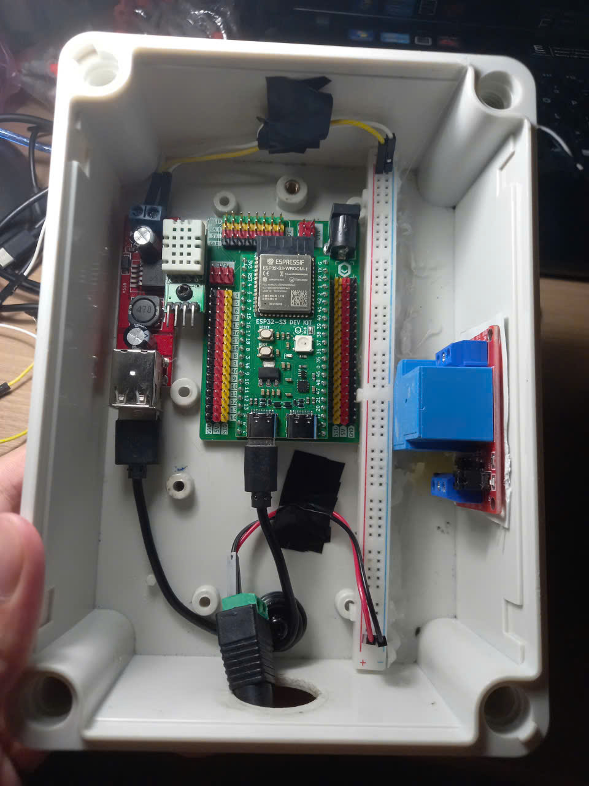

## Components

| Component | Model |
|------------|---------|
| Microcontroller | ESP32-S3 DevKit |
| Soil Sensor | Capacitive Soil Moisture Sensor |
| Water Pump | R385 Water Pump 12VDC |
| Motor Controller | Relay 12VDC-30A |
| DC Adapter | 2.1mm Barrel Jack 12VDC-3A |
| Adpter Cable | Female DC Barrel Jack Cable|
| DC-DC Converter | 12V → 5V 3A Dual USB Buck Converter |

## Pinout

## Schematic

## Casing

<!--
## References

- [Why most Arduino Soil Moisture Sensors suck](https://www.youtube.com/watch?v=udmJyncDvw0)
- [ESP32: Build Your Own Smart Home Sensor in 10 Minutes](https://www.youtube.com/watch?v=llA2mdCh7Kc)
- [Wireless Soil Moisture Sensor Series](https://www.youtube.com/playlist?list=PLUUG94AI2ymwWiahyhoqb7W22lq5oEMo-)
- [Flaura - Smart Plant Pot](https://www.youtube.com/@FlauraSmartPlantPot/featured)
- [Saving Plants - DIY Plant Watering Device](https://github.com/DFRobot/SmartWateringDevice)
-->
