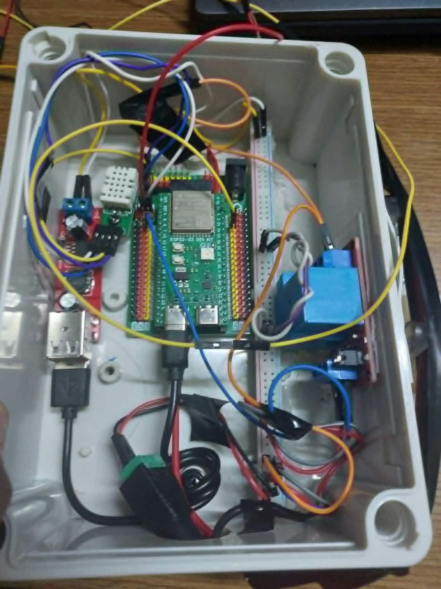

## Table of Contents
1. [Project Overview](#1-project-overview)
2. [Bill of Materials](#2-bill-of-materials)
3. [Pinout & Wiring Diagram](#3-pinout--wiring-diagram)
   - [ESP32-S3 Pinout](#esp32-s3-pinout-1)
   - [IO Shield Pinout](#io-shield-pinout-2)
   - [Wiring Diagram](#wiring-diagram)
   - [Physical Implementation](#physical-implementation)
   - [ESP32-S3 GPIO Mapping](#esp32-s3-gpio-mapping)
   - [Power Distribution & Actuator Wiring](#power-distribution--actuator-wiring)
4. [Sensors and Hardware Design Decisions](#4-sensors-and-hardware-design-decisions)
5. [Limitations and Future Improvements](#5-limitations-and-future-improvements)
6. [Conclusion](#6-conclusion)
7. [Bibliography](#7-citations)

## 1. Project Overview

## 2. Bill of Materials

| Item | Model | Specification|
|:------------|:------------|:------------:|
| Microcontroller | ESP32-S3 DevKit | 16MB Flash - 8MB PSRAM |
| Expansion Board | MKE-B01 ESP32-S3 DK IO Shield | Breakout |
| Soil Moisture Sensor | Generic Capacitive Soil Moisture Sensor v2.0 | 3.3V-5V (Analog) |
| Environmental Sensor | SHTC3 Digital Humidity & Temperature Sensor | 3.3V (I2C) |
| Motor Controller | 1-Channel Opto-Isolated Relay Module | 12VDC - 30A |
| DC Power Adapter |  AC/DC Wall Adapter | 12VDC - 3A (5.5x2.1mm) |
| Step-down Converter | Dual USB Buck Converter | 5VDC - 3A |
| Water Pump | R385 Water Pump | 12VDC |
| Adapter Cable | Female DC Barrel Jack Cable| 5.5x2.1mm Jack |

## 3. Pinout & Wiring Diagram

### ESP32-S3 Pinout *[[1]](#cite1)*
<p align="center">
   
</p>

### IO Shield Pinout *[[2]](#cite2)*
<p align="center">
   
</p>

### Wiring Diagram
<p align="center">
   
</p>

### Physical Implementation
<p align="center">
   
</p>

---

### ESP32-S3 GPIO Mapping

| Component | Component Pin | GPIO Connection | Notes |
| :--- | :---: | :---: | :--- |
| **Soil Moisture Sensor** | VCC | `3V3` | 3.3V Power |
| | GND | `GND` | Ground |
| | AOUT | `GPIO 1` | Analog Output Signal |
| **SHTC3 Temp & Humidity** | VCC | `3V3` | 3.3V Power |
| | GND | `GND` | Ground |
| | SDA | `GPIO 8` | I2C Data Line |
| | SCL | `GPIO 9` | I2C Clock Line |
| **1-Channel Relay Module** | IN | `GPIO 4` | Relay Trigger Signal |

---

### Power Distribution & Actuator Wiring

| Source / Device | Pin / Terminal | Connected To |
| :--- | :---: | :--- |
| **12V DC Adapter** | `+` (Positive) | Buck Converter `IN+`, Relay `COM`, Relay `DC+` |
| | `-` (Ground) | Buck Converter `IN-`, Pump `(-)`, Relay `DC-` |
| **Step-Down Buck Converter** | USB A | ESP32-S3 USB C |
| **1-Channel Relay Module** | `NO` (Normally Open) | Water Pump `(+)` |

---

## 4. Sensors and Hardware Design Decisions

### Capacitive Soil Moisture Sensor

A capacitive soil moisture sensor was selected instead of a resistive soil moisture sensor.

A resistive soil moisture sensor measures the electrical conductivity between two exposed electrodes. Although this type of sensor is simple and inexpensive, the exposed electrodes are in direct contact with wet soil and can gradually corrode due to electrochemical effects. The reading can also be affected by the conductivity and salt content of the soil.

A capacitive soil moisture sensor does not rely on direct current flowing through the soil. Instead, it measures changes in the dielectric properties around the sensing area. This makes it more suitable for long-term installation in an irrigation system because the sensing electrodes are not directly exposed to the soil.

For this reason, the capacitive sensor was chosen mainly for:

- better durability during continuous use;
- lower risk of electrode corrosion;
- more stable use for long-term soil monitoring;
- analog output that can be directly measured by the ESP32-S3 ADC.

The raw analog value is later calibrated into a soil moisture percentage before being transmitted to the server.

---

### SHTC3 Temperature and Humidity Sensor

An SHTC3 temperature and humidity sensor is installed inside the enclosure.

Unlike the soil moisture sensor, the SHTC3 is not currently used directly for irrigation control. Its purpose is to monitor the internal environmental conditions of the electronics enclosure.

The sensor provides:

- internal enclosure temperature;
- internal relative humidity.

This information can be useful for checking whether the electronics are operating in an unsuitable environment, for example if heat builds up inside the enclosure or if high humidity creates a risk of condensation.

The SHTC3 communicates with the ESP32-S3 using the I2C interface.

---

### Flyback Diode for the Water Pump

The water pump contains a DC motor, which is an inductive load.

When the motor is switched off, the collapsing magnetic field can generate a voltage spike in the opposite direction. This transient voltage can interfere with or damage the switching circuit.

A flyback diode was therefore connected across the water pump.

During normal operation, the diode does not conduct. When the pump is switched off, the diode provides a path for the inductive current and helps suppress the voltage transient.

This was added to improve the electrical protection and reliability of the pump switching circuit.

## 5. Limitations and Future Improvements

### MOSFET Pump Control Failure

The original design used a MOSFET to control the water pump.

The MOSFET approach was preferred because it would allow the pump to be controlled using PWM. This would make it possible to adjust the average power delivered to the motor and therefore provide more control over the water flow.

The circuit initially worked during early testing. However, during later testing, the pump could no longer be operated through the MOSFET circuit.

The pump still operated when connected directly to its power supply, and an electrical control signal from the ESP32 could also be measured. However, the complete MOSFET switching stage failed to operate the pump reliably.

Because the exact cause could not be identified within the available project time, the MOSFET circuit was replaced with a relay.

Possible causes were not investigated far enough to make a definite conclusion, so this remains one of the unresolved problems of the prototype.

---

### Relay as a Practical Replacement

The relay was selected mainly because a reliable working system was required within the available development time.

A suitable compact relay was not available locally, so a **12 VDC relay module with a 30 A contact rating** was used instead.

This relay is physically much larger and has a much higher current rating than required by the water pump. It is therefore electrically oversized for the application.

However, it was readily available and provided reliable ON/OFF control of the pump.

The main disadvantage compared with the original MOSFET design is that the current implementation only provides two pump states:

```text
Pump ON
Pump OFF
```
## 7. Bibliography:
<a id="cite1"></a>[1] [MakerEdu MKE-K01 ESP32-S3 DevKit](https://github.com/makereduvn/MKE-K01-ESP32-S3-DEV-KIT). Sơ đồ chân.  

<a id="cite2"></a>[2] [MakerEdu MKE-B01 ESP32-S3 IO Shield](https://github.com/makereduvn/MKE-B01-ESP32-S3-DK-IO-SHIELD). Hình ảnh sản phẩm.
<!--
## References

- [Why most Arduino Soil Moisture Sensors suck](https://www.youtube.com/watch?v=udmJyncDvw0)
- [ESP32: Build Your Own Smart Home Sensor in 10 Minutes](https://www.youtube.com/watch?v=llA2mdCh7Kc)
- [Wireless Soil Moisture Sensor Series](https://www.youtube.com/playlist?list=PLUUG94AI2ymwWiahyhoqb7W22lq5oEMo-)
- [Flaura - Smart Plant Pot](https://www.youtube.com/@FlauraSmartPlantPot/featured)
- [Saving Plants - DIY Plant Watering Device](https://github.com/DFRobot/SmartWateringDevice)
-->
