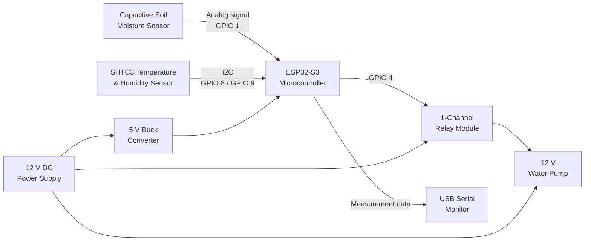
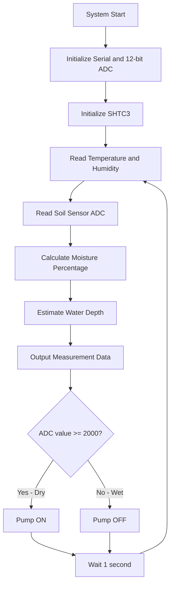
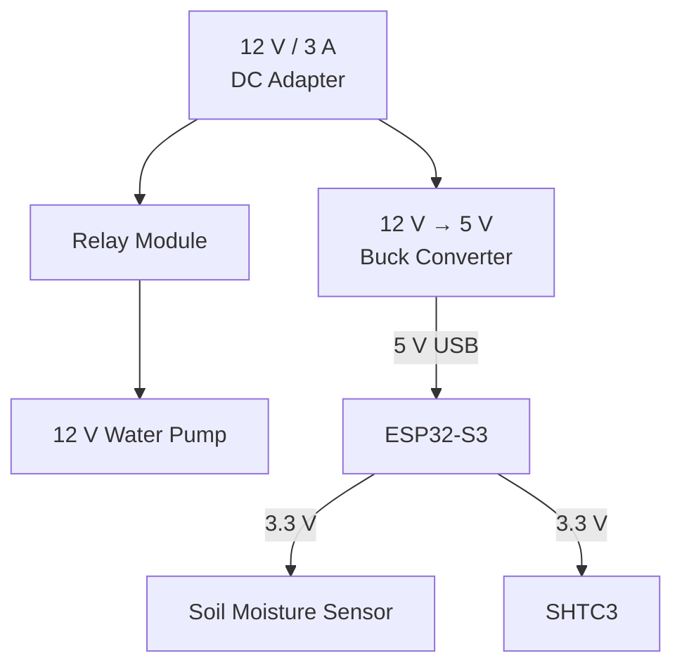

---

## Project Overview

The **Smart Irrigation System** is an automated plant-watering system with integrated environmental monitoring. The system uses an **ESP32-S3** as the main controller, a **capacitive soil moisture sensor** to estimate soil water content, an **SHTC3 digital temperature and humidity sensor** to monitor the surrounding environment, and a **12 V water pump** controlled through a relay.

The main objective is to automatically provide water when the soil becomes too dry while simultaneously collecting environmental data. This reduces the need for manual watering and demonstrates how sensor measurements, embedded software, actuator control, and power electronics can be combined into a complete measurement and control system.

The overall operating sequence is:

1. Measure ambient temperature and relative humidity using the SHTC3.
2. Read the analog output from the capacitive soil moisture sensor.
3. Convert the raw ADC value into a normalized soil moisture percentage.
4. Estimate standing-water depth using experimentally determined calibration points.
5. Determine whether irrigation is required.
6. Switch the water pump through the relay.
7. Send all measurement and system-state information to the Serial interface.

---

## System Architecture

The system consists of three main functional layers:

- **Sensing:** Soil moisture, temperature, and relative humidity are measured.
- **Processing and control:** The ESP32-S3 processes the sensor values and makes the irrigation decision.
- **Actuation and output:** The relay controls the water pump while measurement data is transmitted through Serial.



### Measurement and Control Flow



---

## Sensors

### 1. Capacitive Soil Moisture Sensor

The main irrigation sensor is a **Generic Capacitive Soil Moisture Sensor v2.0**. Unlike a simple resistive probe, a capacitive moisture sensor detects changes in the electrical properties of the material surrounding its sensing area.

Water has a substantially different dielectric response from dry soil. Therefore, changes in soil water content affect the effective capacitance detected by the sensor. Internal circuitry converts this change into an analog voltage that can be measured by the ADC of the ESP32-S3. Capacitive probes also avoid exposing two measurement electrodes directly to the soil, which reduces the electrode-corrosion problem associated with many resistive probes. The general operating and calibration principle of capacitive soil moisture sensors is described in [4].

The sensor used in this project provides three connections:

| Pin | Function |
| :--- | :--- |
| VCC | 3.3 V supply |
| GND | Ground |
| AOUT | Analog measurement output to `GPIO 1` |

The software configures the ADC resolution as:

```cpp
analogReadResolution(12);
```

A measurement is then obtained using:

```cpp
int rawValue = analogRead(SOIL_PIN);
```

where:

```cpp
const int SOIL_PIN = 1;
```

A **higher raw ADC value corresponds to drier soil** in the calibration used for this project, while a lower value represents wetter conditions.

> **Important:** The resulting moisture percentage is a calibrated relative value rather than a laboratory measurement of volumetric water content. Soil type, compaction, insertion depth, sensor position, temperature, and individual sensor variation can influence the reading [4].

---

### Soil Moisture Calibration

The following calibration constants are currently used:

```cpp
const int VAL_DRY = 2350;
const int VAL_WET_SOIL = 1550;
```

Therefore:

- `2350` represents the selected dry reference and is mapped to approximately **0%**.
- `1550` represents the selected wet reference and is mapped to approximately **100%**.

The conversion is performed in the firmware using:

```cpp
int moisturePercent = map(
    rawValue,
    VAL_DRY,
    VAL_WET_SOIL,
    0,
    100
);

moisturePercent = constrain(moisturePercent, 0, 100);
```

Conceptually, the conversion can be represented as:

$$
M =
\frac{V_{dry}-V_{raw}}
     {V_{dry}-V_{wet}}
\times 100\%
$$

where:

- $M$ = normalized soil moisture percentage,
- $V_{raw}$ = current ADC reading,
- $V_{dry}$ = calibrated dry value (`2350`),
- $V_{wet}$ = calibrated wet value (`1550`).

The result is constrained between 0% and 100% so readings outside the calibration interval do not result in negative moisture or values above 100%.

---

### Standing-Water Depth Calibration

In addition to the standard dry-to-wet soil calibration, the project experimentally characterizes the sensor response when progressively immersed in water.

The current firmware contains the following calibration points:

| Reference condition | Raw ADC value |
| :--- | ---: |
| Dry reference | `2350` |
| Wet soil / 1 cm water reference | `1550` |
| 2 cm water depth | `1300` |
| 3 cm water depth | `1113` |
| 4 cm water depth | `1068` |
| 5 cm water depth | `1012` |
| 6 cm water depth | `981` |

The firmware performs **piecewise linear interpolation** between these measured calibration points. For example, for a measurement between the 1 cm and 2 cm calibration values:

```cpp
waterDepthCm =
    1.0 +
    ((VAL_1CM - rawValue) /
    (float)(VAL_1CM - VAL_2CM));
```

The same interpolation method is applied to the remaining intervals up to 6 cm.

This provides a useful additional visualization of the capacitive sensor response. However, the calculated water depth is an **empirical estimate specific to the geometry and calibration setup used in this project** and should not be considered a universal water-level measurement method.

---

### 2. SHTC3 Temperature and Humidity Sensor *[[3]](#cite3)*

The **SHTC3** is a digital humidity and temperature sensor manufactured by Sensirion. According to the manufacturer, the device integrates a capacitive humidity sensor, temperature sensor, signal processing, analog-to-digital conversion, calibration memory, and an I2C digital communication interface [3].

The SHTC3 supports a relative humidity measurement range of **0–100% RH** and a temperature range of **-40°C to 125°C**. The manufacturer's typical specified accuracy is approximately **±2% RH** and **±0.2°C** under the relevant operating conditions [3].

In this system, the sensor is connected to the ESP32-S3 through I2C:

| SHTC3 Pin | ESP32-S3 |
| :--- | :--- |
| VCC | `3V3` |
| GND | `GND` |
| SDA | `GPIO 8` |
| SCL | `GPIO 9` |

The project uses the **Adafruit SHTC3 Arduino library** [5]:

```cpp
#include "Adafruit_SHTC3.h"

Adafruit_SHTC3 shtc3 = Adafruit_SHTC3();
```

During initialization, the software checks whether communication with the SHTC3 can be established:

```cpp
if (!shtc3.begin()) {
    Serial.println("Couldn't find SHTC3");
    while (1) delay(1);
}
```

During each loop iteration, a new temperature and humidity measurement is requested:

```cpp
sensors_event_t humidity, temp;
shtc3.getEvent(&humidity, &temp);
```

The values can then be accessed using:

```cpp
temp.temperature
humidity.relative_humidity
```

Environmental measurements are currently used for monitoring rather than directly controlling the irrigation decision. This separates the basic watering control from environmental observation while leaving the system open to more advanced control algorithms in future versions.

---

## Actuator and Irrigation Output

### Relay Module

A 1-channel relay module provides the electrical switching interface between the low-voltage ESP32-S3 control signal and the 12 V water-pump circuit.

The relay input is connected to:

```cpp
const int PUMP_PIN = 4;
```

and configured as a digital output:

```cpp
pinMode(PUMP_PIN, OUTPUT);
```

The current firmware treats:

```cpp
digitalWrite(PUMP_PIN, HIGH);
```

as **pump ON**, and:

```cpp
digitalWrite(PUMP_PIN, LOW);
```

as **pump OFF**.

The relay contacts are placed in series with the positive pump supply:

```text
12 V (+)
   |
   v
Relay COM
   |
   |  Relay closed
   v
Relay NO
   |
   v
Pump (+)

Pump (-)
   |
   v
12 V (-)
```

Using the **Normally Open (NO)** relay contact means the pump does not receive power while the relay contact is open.

> The trigger polarity must match the actual relay module being used. The current source code drives `HIGH` for ON and `LOW` for OFF; comments describing the relay as active-low should therefore be verified and corrected if necessary.

---

### Water Pump

The actuator is an **R385 12 V DC water pump**. It is powered directly from the 12 V power domain and is not powered from the ESP32-S3.

This is necessary because the pump requires considerably more electrical power than a microcontroller GPIO can supply. The ESP32-S3 therefore controls only the relay input, while the relay switches the separate pump power circuit.

---

## Power Architecture

The project uses a 12 V / 3 A DC adapter as its primary power source.

The 12 V supply is divided into two paths:

1. **12 V actuator path**
   - relay power;
   - water-pump power.

2. **Low-voltage controller path**
   - 12 V is supplied to the buck converter;
   - the buck converter reduces the voltage to 5 V;
   - the ESP32-S3 is powered through USB-C;
   - the ESP32-S3 supplies 3.3 V to the sensors.



This arrangement prevents the pump from being powered through the ESP32-S3 and separates the high-current actuator path from the sensor and controller supply path.

---

## Software Architecture

The firmware can be divided into five functional sections:

```text
+------------------------------------------------------+
|                  Application Layer                   |
|                                                      |
|  Moisture conversion | Watering decision | Output   |
+------------------------------------------------------+
                         |
+------------------------------------------------------+
|                 Sensor Processing                    |
|                                                      |
|  Soil ADC calibration | Water-depth interpolation   |
+------------------------------------------------------+
                         |
+------------------------------------------------------+
|                Device Interface Layer                |
|                                                      |
|  analogRead() | Adafruit SHTC3 | GPIO control       |
+------------------------------------------------------+
                         |
+------------------------------------------------------+
|                    Hardware                          |
|                                                      |
| ESP32-S3 | Soil Sensor | SHTC3 | Relay | Pump       |
+------------------------------------------------------+
```

The complete development sketch is available in:

```text
src/clean.ino
```

with another development version stored in:

```text
src/plan-watering.ino
```

---

### Program Initialization

The important global pin assignments are:

```cpp
const int SOIL_PIN = 1;
const int PUMP_PIN = 4;
```

The serial connection is initialized at:

```cpp
Serial.begin(115200);
```

The ADC is configured for 12-bit readings:

```cpp
analogReadResolution(12);
```

The SHTC3 is initialized next. If it cannot be detected, execution remains in an error loop instead of continuing with invalid environmental measurements.

Finally, the pump-control GPIO is configured as an output.

---

### Main Program Loop

The main loop performs the following operations once per second:

```text
Read SHTC3
    ↓
Read soil ADC
    ↓
Convert ADC → moisture %
    ↓
Estimate water depth
    ↓
Send values through Serial
    ↓
Compare ADC against threshold
    ↓
Switch pump ON/OFF
    ↓
Delay 1000 ms
    ↓
Repeat
```

This design is intentionally simple because the irrigation decision can be made directly from the soil measurement without requiring a complex control algorithm.

---

## Automatic Watering Logic

The current control threshold is:

```cpp
if (rawValue >= 2000) {
    digitalWrite(PUMP_PIN, HIGH);
}
else {
    digitalWrite(PUMP_PIN, LOW);
}
```

Because a larger ADC reading corresponds to drier soil:

| Condition | ADC value | Pump state |
| :--- | :---: | :---: |
| Dry | `>= 2000` | ON |
| Sufficiently wet | `< 2000` | OFF |

Using the current calibration interval of 2350 for dry soil and 1550 for wet soil, an ADC value of 2000 corresponds to approximately **44% of the calibrated moisture range**.

Therefore, the simplified control objective is:

```text
Moisture below approximately 44%
             ↓
          Pump ON
             ↓
     Soil becomes wetter
             ↓
       ADC falls below 2000
             ↓
          Pump OFF
```

The threshold is deliberately implemented using the raw ADC reading so the automatic control decision does not depend on formatting or rounding of the displayed percentage.

---

## System Output

The current implementation uses the **USB Serial interface** as the primary monitoring output. The baud rate is:

```text
115200 baud
```

The system reports:

- ambient temperature in degrees Celsius;
- relative humidity in percent;
- raw soil-moisture ADC measurement;
- calculated soil-moisture percentage;
- estimated standing-water depth;
- pump ON/OFF status.

Temperature and humidity are printed as readable text:

```text
Temperature: ... degrees C
Humidity: ...% rH
```

The soil measurement is additionally formatted as a JSON-like object:

```json
{
  "raw": 1725,
  "moisture_percent": 78,
  "water_depth_cm": 0.00
}
```

The values above are only an example of the output format and are not experimental results.

The structured format was selected so the measurement data can be parsed more easily by another program if the project is later expanded with a graphical interface, data logger, web server, or IoT dashboard.

At the current stage of the project, however, **no web interface or GUI is implemented**. The Serial Monitor is the actual user-visible measurement interface.

---

## Calibration Procedure

### Soil Moisture Calibration

A practical calibration procedure is:

1. Connect the soil moisture sensor to the ESP32-S3.
2. Open the Serial Monitor at `115200` baud.
3. Record the sensor output under the selected dry reference condition.
4. Insert the probe into fully wetted soil at a consistent depth.
5. Record the wet reference value.
6. Update:

```cpp
const int VAL_DRY = ...;
const int VAL_WET_SOIL = ...;
```

7. Repeat measurements to verify that the normalized result covers the intended 0–100% range.

The calibration currently stored in the firmware is:

```cpp
VAL_DRY      = 2350
VAL_WET_SOIL = 1550
```

Because capacitive soil sensors are affected by the soil material and installation geometry, calibration should ideally be performed using the same soil and insertion depth used during normal operation [4].

---

### Water-Depth Calibration

The current calibration table extends the experiment by recording the ADC response at different immersion depths:

```cpp
const int VAL_1CM = 1550;
const int VAL_2CM = 1300;
const int VAL_3CM = 1113;
const int VAL_4CM = 1068;
const int VAL_5CM = 1012;
const int VAL_6CM = 981;
```

Intermediate values are estimated through piecewise linear interpolation.

This part of the project demonstrates that the raw sensor output can be characterized experimentally rather than simply interpreted as an arbitrary ADC number.

---

## Testing

The system should be evaluated independently at the sensor, processing, and actuator levels.

### 1. Soil Moisture Test

Measurements should be taken under multiple known conditions.

| Test Condition | Raw ADC | Calculated Moisture | Pump State |
| :--- | ---: | ---: | :---: |
| Dry soil | _Measured value_ | _Calculated value_ | _ON/OFF_ |
| Slightly moist | _Measured value_ | _Calculated value_ | _ON/OFF_ |
| Moderately moist | _Measured value_ | _Calculated value_ | _ON/OFF_ |
| Wet soil | _Measured value_ | _Calculated value_ | _ON/OFF_ |

Multiple measurements at each condition would allow repeatability and measurement variation to be evaluated.

---

### 2. Water-Depth Calibration Test

| Reference Depth | Calibration ADC | Measured ADC | Error |
| :---: | ---: | ---: | ---: |
| 1 cm | `1550` | _Measure_ | _Calculate_ |
| 2 cm | `1300` | _Measure_ | _Calculate_ |
| 3 cm | `1113` | _Measure_ | _Calculate_ |
| 4 cm | `1068` | _Measure_ | _Calculate_ |
| 5 cm | `1012` | _Measure_ | _Calculate_ |
| 6 cm | `981` | _Measure_ | _Calculate_ |

The error may be calculated as:

$$
E = x_{measured} - x_{reference}
$$

and the absolute percentage error as:

$$
E_{\%} =
\frac{|x_{measured}-x_{reference}|}
     {x_{reference}}
\times100\%
$$

---

### 3. Pump-Control Test

The automatic threshold can be tested by changing the moisture condition around the ADC value of 2000.

Expected behavior:

| ADC | Expected State |
| ---: | :--- |
| 2200 | Pump ON |
| 2050 | Pump ON |
| 2000 | Pump ON |
| 1999 | Pump OFF |
| 1800 | Pump OFF |
| 1550 | Pump OFF |

These values represent the programmed control logic; actual sensor measurements should also be recorded during experimental testing.

---

### 4. Environmental Sensor Test

The SHTC3 output should be compared under several environmental conditions.

| Test | Temperature | Relative Humidity |
| :--- | ---: | ---: |
| Room condition | _Measure_ | _Measure_ |
| Near plant/soil | _Measure_ | _Measure_ |
| High-humidity condition | _Measure_ | _Measure_ |

For a more rigorous evaluation, measurements may be compared against another calibrated thermometer or hygrometer.

---

## Design Considerations and Limitations

### Soil-dependent Calibration

The reported soil moisture percentage is derived from two experimental ADC endpoints. It should therefore be understood as a **relative calibrated moisture index**, not a direct measurement of volumetric water content.

Different soil types can have different dielectric characteristics. Changes in probe insertion depth and soil packing may also influence the sensor output [4].

### Single Irrigation Threshold

The current control system uses one threshold:

```text
2000
```

This means that the pump changes state on opposite sides of the same value. If sensor noise causes repeated measurements close to the threshold, the relay could repeatedly switch between ON and OFF.

A future version could introduce **hysteresis**, for example by using separate thresholds:

```text
Dry threshold → Pump ON
Wet threshold → Pump OFF
```

where the OFF threshold is sufficiently separated from the ON threshold.

### Environmental Data Not Yet Used for Control

Temperature and humidity are measured and reported but are not currently used in the irrigation decision.

Future irrigation logic could take into account environmental conditions such as higher temperature or lower relative humidity when determining watering requirements.

### Water-Depth Estimate

The water-depth calculation is based on empirical calibration of the capacitive sensor and is not a dedicated liquid-level measurement system. The calibration should therefore only be considered valid for the experimental configuration in which the values were obtained.

### Blocking Delay

The firmware currently contains:

```cpp
delay(1000);
```

This makes the simple program easy to understand, but blocks execution for one second during every loop.

For future expansion involving Wi-Fi, a GUI, multiple actuators, or more frequent sensor processing, non-blocking timing using `millis()` or separate FreeRTOS tasks would provide a more flexible architecture.

### Serial Dependency

The initialization currently contains:

```cpp
while (!Serial)
    delay(10);
```

For a completely autonomous irrigation device, the startup procedure should be tested without a computer connected. If necessary, the Serial waiting stage can be removed or provided with a timeout.

### Relay Logic Verification

The current program uses `HIGH` for pump ON and `LOW` for pump OFF, while some source-code comments describe the relay as active-low. The actual trigger behavior should be verified on the installed relay module and the comments updated to match the hardware.

---

## Original Contributions

The project integrates several measurement and control functions into a single embedded system:

1. **Automatic closed-loop irrigation** based on the measured soil condition.
2. **Environmental monitoring** using an independent digital temperature and humidity sensor.
3. **Experimental calibration** of the capacitive soil sensor rather than relying only on arbitrary raw ADC values.
4. **Conversion of the sensor output to a normalized moisture percentage.**
5. **Piecewise interpolation of experimental water-depth calibration points.**
6. **Structured serial output** that can later be consumed by software or a web interface.
7. **Separated power architecture** for the low-voltage controller and 12 V pump.
8. **Visual hardware and software architecture documentation** describing the complete sensing-to-actuation signal chain.

A useful additional visualization for the final report would be a graph of:

```text
ADC value vs. soil moisture condition
```

and a second graph of:

```text
ADC value vs. measured water depth
```

Using the measured experimental values rather than only the calibration constants would provide evidence of repeatability and would make the performance of the measurement system easier to evaluate.

---

## Future Improvements

Possible extensions include:

- add separate ON and OFF moisture thresholds to implement hysteresis;
- average multiple ADC samples to reduce noise;
- use a median or moving-average digital filter;
- store calibration constants in non-volatile memory;
- add a physical manual-watering button;
- detect an empty water tank;
- add pump run-time protection;
- record historical temperature, humidity, and soil-moisture values;
- add Wi-Fi monitoring;
- implement a local ESP32 web server;
- display measurements in a graphical dashboard;
- add MQTT or another IoT protocol;
- include temperature and humidity in the irrigation algorithm;
- replace fixed thresholds with plant-specific configurable values;
- implement non-blocking scheduling rather than `delay()`;
- investigate a dedicated water-level sensor if accurate water-depth measurement is required.

---

## Conclusion

The Smart Irrigation System demonstrates a complete embedded measurement and control chain consisting of sensing, data acquisition, signal interpretation, control logic, actuation, and user output.

The capacitive soil moisture sensor provides the primary feedback signal for irrigation. Its analog output is sampled by the ESP32-S3 and converted into a calibrated moisture percentage. The project extends this measurement through experimentally obtained water-depth calibration points and piecewise interpolation.

An SHTC3 digital sensor independently measures ambient temperature and relative humidity through the I2C interface. These measurements provide additional information about the plant environment and create a basis for more advanced irrigation algorithms.

When the soil sensor indicates a sufficiently dry condition, the ESP32-S3 controls a relay that connects the 12 V supply to the water pump. Once the measured condition passes the programmed wet threshold, the pump is switched off. Measurement values and pump state are transmitted through the Serial interface for monitoring and testing.

The completed prototype therefore demonstrates how environmental sensors, analog measurement, calibration, embedded programming, power conversion, relay control, and an electromechanical actuator can be integrated into a practical automatic irrigation application.

---

## Additional Citations

<a id="cite3"></a>[3] [Sensirion — SHTC3 Humidity and Temperature Sensor Datasheet](https://sensirion.com/resource/datasheet/shtc3). Technical specifications, measurement principle, accuracy, measurement range, and I2C interface.

<a id="cite4"></a>[4] [DFRobot — Capacitive Soil Moisture Sensor Documentation](https://wiki.dfrobot.com/sen0193/). General capacitive soil-moisture measurement and dry/wet calibration method. Used as a reference for the measurement principle; the sensor described by DFRobot is not necessarily identical to the generic V2.0 module used in this project.

<a id="cite5"></a>[5] [Adafruit — Adafruit SHTC3 Arduino Library](https://github.com/adafruit/Adafruit_SHTC3). Arduino software interface used for SHTC3 temperature and humidity acquisition.

---

## Source Code

The firmware is included directly in this repository rather than as screenshots, as required by the project submission guidelines.

Main development files:

- [`src/clean.ino`](src/clean.ino) — integrated soil moisture, SHTC3, calibration, water-depth estimation, Serial output, and pump-control implementation.
- [`src/plan-watering.ino`](src/plan-watering.ino) — development version of the integrated firmware.
- [`plant-watering.ino`](plant-watering.ino) — earlier simplified pump-control implementation.

The submitted `.zip` should contain this source code together with the final report, wiring schematic, relevant drawings, and other project material.